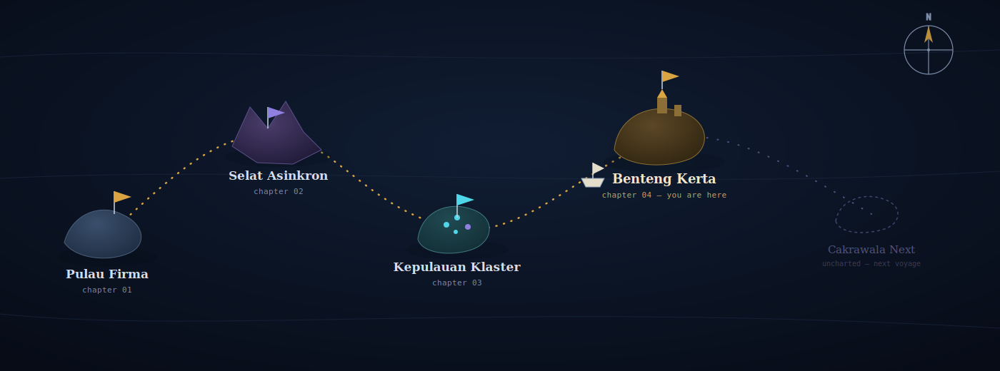

<div align="center">



<sub><i>a map, not a resume.</i></sub>

<br><br>

<a href="#chapter-01--pulau-firma">Pulau&nbsp;Firma</a> &nbsp;→&nbsp;
<a href="#chapter-02--selat-asinkron">Selat&nbsp;Asinkron</a> &nbsp;→&nbsp;
<a href="#chapter-03--kepulauan-klaster">Kepulauan&nbsp;Klaster</a> &nbsp;→&nbsp;
<a href="#chapter-04--benteng-kerta-current">Benteng&nbsp;Kerta</a> &nbsp;→&nbsp;
<a href="#chapter-05--cakrawala-next-uncharted">Cakrawala&nbsp;Next</a>

</div>

<br>

## Ship's Manifest

**Captain:** Ghifari Diaz Fahrezi
**Vessel class:** Backend Developer, Laravel/PHP rigging
**Current heading:** Information Technology — 6th semester
**Voyage started:** with a single `<div>` and no idea what a semicolon was for

<br>

---

### Chapter 01 — Pulau Firma
<sub>`coordinates: the beginning` · `cargo: HTML, CSS, first Laravel CRUD`</sub>

Every voyage starts on solid ground. Pulau Firma is where the basics were
laid down — HTML that didn't validate, CSS fought line by line, and
eventually a full Laravel 6 CRUD app built from nothing but documentation
and stubbornness. Not glamorous. Necessary. This is the island every later
chapter quietly depends on.

`HTML` `CSS` `PHP` `Laravel 6`

<br>

### Chapter 02 — Selat Asinkron
<sub>`coordinates: the strait everyone fears` · `monster: JavaScript / Python Async`</sub>

The map doesn't lie about this one — the water here is rough. This is
where synchronous thinking stopped working: a multiplayer TCP quiz game
that had to track several players at once, then a full chat bridge
connecting WebSocket and TCP clients through Python's `asyncio`, where
one blocked call could sink the whole connection. The monster wasn't a
bug. It was a mental model that had to be rebuilt from scratch.

`Python` `asyncio` `WebSocket` `TCP Sockets`

<br>

### Chapter 03 — Kepulauan Klaster
<sub>`coordinates: an archipelago of data points` · `treasure: pattern recognition`</sub>

A quieter chapter, spent charting rather than fighting. A full data
mining practicum comparing K-Means against DBSCAN on customer
segmentation data — K-Means came back with a **0.5547 Silhouette Score**
at K=5, DBSCAN with **0.3504**. The takeaway that stuck: not every
algorithm deserves the job, and knowing why is worth more than knowing
how.

`Python` `Scikit-learn` `K-Means` `DBSCAN`

<br>

### Chapter 04 — Benteng Kerta <sub>(current)</sub>
<sub>`coordinates: 6°S, present day` · `status: anchored, actively building`</sub>

The fortress island. This is where the ship sits now, building the HR
management system for **PT BPR Kerta Raharja Gemilang (Bank Kerta)** —
GPS-geofenced attendance, payroll running BPJS/PPh21 calculations, and a
sequential leave-approval workflow (`pending → divalidasi_sdm →
approved/rejected`) that has to survive concurrent requests without two
approvers colliding. This chapter is still being written, one migration
at a time.

`Laravel 12` `FilamentPHP v3` `MySQL` `Race-Condition Safety`

<br>

### Chapter 05 — Cakrawala Next <sub>(uncharted)</sub>
<sub>`coordinates: unknown` · `heading: frontend waters`</sub>

The dotted line on the map. Next stop isn't landed yet — a personal
portfolio being built in **Next.js 14** with **React Three Fiber**,
**Framer Motion**, and **GSAP**, in a navy/cyan/violet/amber palette.
The compass is pointed. The sails aren't up yet.

`Next.js` `React Three Fiber` `Tailwind CSS` `Framer Motion`

<br>

---

<br>

## Cargo Hold <sub>(current stack)</sub>

<table>
<tr>
<td valign="top" width="33%">

**Backend**
```
PHP
Laravel
FilamentPHP
Python
```

</td>
<td valign="top" width="33%">

**Frontend**
```
Next.js
React
Tailwind CSS
Framer Motion
```

</td>
<td valign="top" width="33%">

**Tools**
```
MySQL
Git
PhpStorm
Laragon
```

</td>
</tr>
</table>

<br>

<div align="center">


<br><br>

[`GitHub`](https://github.com/GhifariDiazz) &nbsp;·&nbsp; [`LinkedIn`](#) &nbsp;·&nbsp; [`Email`](#)

<sub>— chart your own island, and I'll trade routes —</sub>

</div>